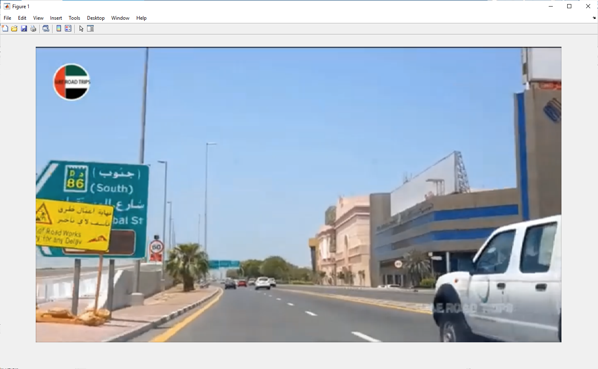
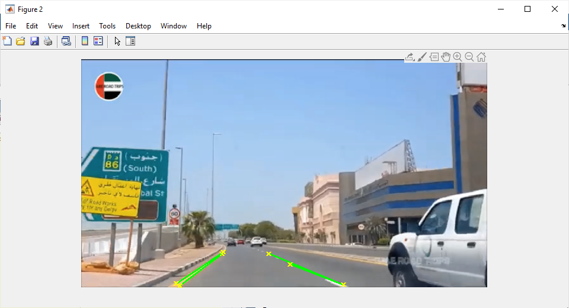
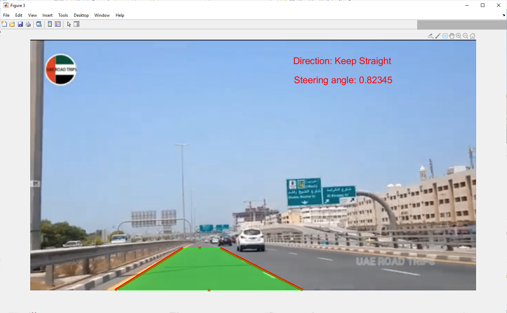

# Lane-Detection-Matlab-
Detection of lanes and determining the steering angle of the vehicle
test_3.mp4 is the original input file
Result.avi is the output file

# Lane Detection – ECTE 401 Image Processing Project

##  Introduction  
The Lane Analyser project demonstrates an image processing–based approach for **lane detection** in driving scenarios. By analyzing pre-recorded driving videos, the system detects lane markings, highlights the lane path, predicts vehicle direction, and estimates the steering angle required. This project is an early step toward autonomous driving technologies.

---

## Objectives  
- Detect the lane in which the car is currently traveling.  
- Highlight the lane section ahead of the vehicle.  
- Predict the car’s movement direction (left, right, or straight).  
- Calculate the steering angle required for lane following.  

---

##  Scope & Limitations  
- Works only with **pre-recorded videos**.  
- Performance may degrade if:  
  - Lane markings are faded or missing.  
  - The road curvature is very sharp.  
  - Lane changes occur during runtime.  

---

##  Methodology  
The project is implemented in **MATLAB** and involves the following steps:  

1. **Frame Extraction**  
   - Video frames extracted for lane analysis.  

2. **Image Preprocessing**  
   - Gaussian filtering for noise removal.  
   - Thresholding to isolate yellow and white lane lines.  
   - Canny edge detection applied.  
   - Region of Interest (ROI) masks applied to isolate lane edges.  

   

3. **Hough Transform**  
   - Lines detected using Hough Transform.  
   - Peak intersections identified to select valid lane lines.  

   

4. **Line Selection & Extrapolation**  
   - Strongest lane edges selected.  
   - Lines extended to cover the full frame.  

   

5. **Direction & Steering Angle Prediction**  
   - Lane intersection and central coordinates used for turn prediction.  
   - Steering angle calculated using a 12:1 steering ratio.  
   - Frames plotted with detected lanes and predicted turns.  

   

---

##  Results  
- Average processing time per frame: **0.1639 seconds**.  
- Total time for 790 frames: **~129.5 seconds**.  
- Robust for straight and moderately curved roads.  
- Future improvements may include advanced tracking methods and testing on varied video datasets.  

---

##  References  
1. Transportation Cost and Benefit Analysis II - Safety and Health Costs. (2021).  
2. Shah, Y. (2021). *GitHub - Lane Detection using MATLAB*. [Link](https://github.com/ysshah95/Lane-Detection-using-MATLAB)  
3. Wikipedia. (2019). *Steering ratio*.  
4. Video Source: *UAE Road Trips (YouTube)*.  

